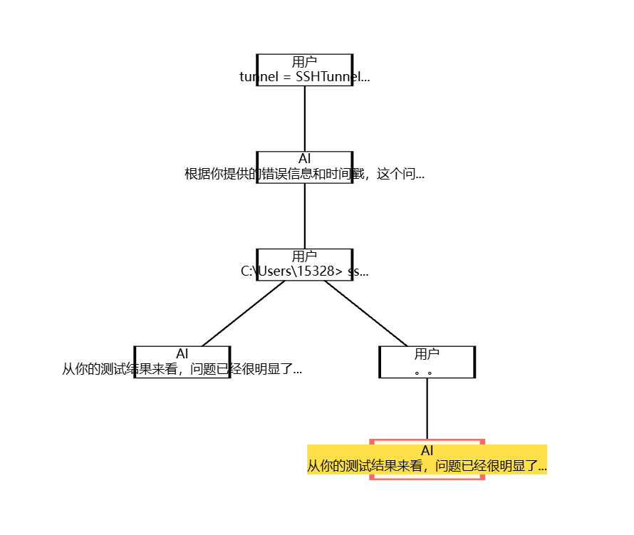

# 循迹（XunJi）

循迹是一个前后端分离的 RAG 对话平台：支持用户登录鉴权、流式多轮聊天、多会话历史管理，并可将本地文档（PDF/TXT/MD）上传构建知识库，通过向量检索实现检索增强生成（RAG）。

平台内置“模型管理/切换”能力，可在 OpenAI 兼容接口（如 DeepSeek、Kimi/Moonshot、通义千问 DashScope）与本地 Ollama、Gemini 等模型之间切换；同时支持按需启用联网搜索（Tavily）提升回答的时效性与可溯源性。

## 功能特性

- 登录/注册 + JWT 鉴权
- 流式聊天（StreamingResponse）与多会话历史管理
- 聊天树（Conversation Tree）：树状分叉、节点回溯、分支切换
- 文档上传建库（PDF/TXT/MD）与 RAG 检索增强
- 多模型适配与模型配置管理（OpenAI 兼容 / Ollama / Gemini 等）
- 可选联网搜索增强（Tavily）



## 技术栈

- 后端：FastAPI、Uvicorn、SQLAlchemy、LangChain、Chroma、python-dotenv
- 前端：Vue 3、Vite、Pinia、Element Plus、Axios、Markdown-It、Highlight.js、ECharts

## 仓库结构

```text
xunji/
  xunji-backup/        # 后端（FastAPI）
  xunji-frontend/      # 前端（Vue3 + Vite）
```

## 快速开始

### 1) 启动后端

前置条件：
- Python 3.9+（代码中使用了 `list[str]` 等类型标注）

安装依赖：

```bash
pip install -r xunji-backup/requirements.txt
```

准备环境变量：
- 复制 [xunji-backup/.env.example](file:///f:/aaa_desktop_file/xunji/xunji-backup/.env.example) 为 `xunji-backup/.env`
- 至少配置 `SQLALCHEMY_DATABASE_URL`、`PERSIST_DIRECTORY`、`RAG_FILE_PATH`、Embedding/LLM 的 API Key（按你的模型选择）

启动服务（在 `xunji-backup` 目录执行）：

```bash
uvicorn app.main:app --host 127.0.0.1 --port 8080
```

接口文档：
- API 说明见 [xunji-backup/api.md](file:///f:/aaa_desktop_file/xunji/xunji-backup/api.md)

### 2) 启动前端

前置条件：
- Node.js 版本请参考 [xunji-frontend/package.json](file:///f:/aaa_desktop_file/xunji/xunji-frontend/package.json) 的 `engines` 字段

安装依赖并启动（在 `xunji-frontend` 目录执行）：

```bash
npm install
npm run dev
```

配置前端 API 地址：
- 复制 [xunji-frontend/.env.example](file:///f:/aaa_desktop_file/xunji/xunji-frontend/.env.example) 为 `xunji-frontend/.env.development`
- 设置 `VITE_API_BASE_URL` 指向你的后端地址

## 环境变量说明（摘要）

后端（`xunji-backup/.env`）常用：
- `SQLALCHEMY_DATABASE_URL`：数据库连接字符串（默认可用 SQLite）
- `PERSIST_DIRECTORY`：Chroma 向量库持久化目录
- `RAG_FILE_PATH`：上传文件落盘目录
- `SPLIT_FILENAME_ID`：保存到本地时用于拼接文件名的分隔符

Embedding：
- `QWEN_EMBEDDING_MODEL`、`QWEN_API_KEY`（DashScope Embedding）
- `EMBEDDING_MODEL`、`OLLAMA_BASE_URL`（Ollama Embedding）

LLM（按需配置其一或多种）：
- `DEEPSEEK_API_KEY`、`DEEPSEEK_API_BASE`
- `MOONSHOT_API_KEY`、`MOONSHOT_BASE_URL`
- `DASHSCOPE_API_KEY`、`DASHSCOPE_BASE_URL`
- `GEMINI_API_KEY`

联网搜索：
- `TAVILY_API_KEY`

## 聊天树（Conversation Tree）

循迹把“会话”建模为一棵树：每次发送消息都会生成一个节点（TreeNode），并通过 `parent_id` 指向父节点，从而自然支持“在任意历史节点上继续对话”的分叉能力。

- **写入规则**
  - 前端发送 `/api/chat` 时携带 `parent_id`（可为空）；后端会为“用户消息”和“AI 回复”分别落一条 TreeNode，并把 AI 节点挂在对应用户节点下面。
  - 在流式返回中，后端会先推送 `user_node_id`，流结束时再推送 `ai_node_id`，前端据此更新“当前叶子节点”。
- **可视化与分支切换**
  - 前端会从 `/api/conversations/{conversation_id}/messages` 拉取消息列表（包含 `node_id` 与 `parent_node_id`），使用 ECharts 生成树状结构。
  - 点击任意节点后，前端调用 `/api/tree/path/{node_id}` 获取“从根到该节点”的完整路径消息，并将该节点设置为新的继续对话起点（后续消息会挂在此节点之下）。

相关实现位置：
- 后端树结构：TreeNode 模型 [sql_models.py](file:///f:/aaa_desktop_file/xunji/xunji-backup/app/models/sql_models.py)
- 聊天流式与节点写入：[chat.py](file:///f:/aaa_desktop_file/xunji/xunji-backup/app/api/endpoints/chat.py)
- 会话/路径查询接口：[history.py](file:///f:/aaa_desktop_file/xunji/xunji-backup/app/api/endpoints/history.py)
- 前端树渲染与交互：[GeminiLayout.vue](file:///f:/aaa_desktop_file/xunji/xunji-frontend/src/views/GeminiLayout.vue)

## 安全提示

- 不要把 `.env`、日志、向量库持久化目录提交到仓库
- 生产环境建议通过反向代理（HTTPS）与更严格的 CORS 配置对外提供服务

## 贡献

欢迎提交 Issue/PR：修复问题、补充文档、完善测试与部署脚本等。
