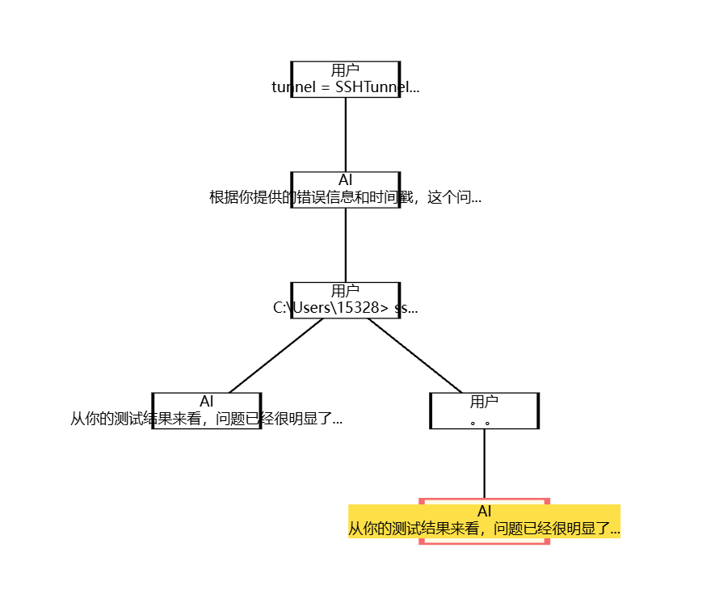

# 循迹 (XunJi)

循迹是一个前后端分离的 RAG (Retrieval-Augmented Generation) 对话平台。它不仅支持基础的流式对话、知识库管理和多模型切换，还创新性地引入了**聊天树 (Conversation Tree)** 概念，支持对话的分叉、回溯与标记，为您提供非线性的思维探索体验。

## 🌟 核心特性
- **非线性对话管理 (Conversation Tree)**
  - **分叉与回溯**：支持在任意历史节点发起新对话，形成树状分叉。
  
  - **可视化树图**：基于 ECharts 实现对话路径的直观展示。
  - **节点标记 (Tagging)**：支持对关键对话节点进行星标标记，辅助识别主线与分支。
- **高性能流式体验**
  - **丝滑滚动**：优化了流式输出时的滚动卡顿，支持智能自动滚动与 `overflow-anchor` 视口锁定。
  - **节流渲染**：采用 `requestAnimationFrame` 与节流技术，降低长对话下的 CPU 占用。
- **智能输入交互**
  - **动态 Enter 逻辑**：单行模式下 Enter 直接发送；一旦通过 Shift+Enter 或粘贴进入多行模式，Enter 自动转为换行，防止误发。
- **RAG 知识库增强**
  - 支持 PDF、TXT、MD 等文档上传。
  - 基于向量数据库的语义检索，提升 AI 回答的专业度与准确性。
- **全方位模型适配**
  - 支持 OpenAI 兼容接口 (DeepSeek, Moonshot, DashScope 等)。
  - 支持本地模型 (Ollama) 与 Gemini 等主流 AI。
- **系统集成**
  - 内置 OpenClaw 服务集成，提供更深度的自动化能力。

## 🛠️ 技术栈

### 前端 (Frontend)
- **框架**: Vue 3 (Composition API)
- **构建工具**: Vite
- **状态管理**: Pinia
- **UI 组件库**: Element Plus
- **图表库**: ECharts (用于聊天树可视化)
- **文本处理**: Markdown-it, Highlight.js (语法高亮)

### 后端 (Backend)
- **框架**: FastAPI
- **异步服务器**: Uvicorn
- **ORM**: SQLAlchemy
- **向量数据库**: ChromaDB
- **大模型框架**: LangChain
- **认证**: JWT (JSON Web Token)

## 📂 项目结构

```text
xunji/
├── xunji-backup/               # 🐍 后端服务 (FastAPI)
│   └── app/
│       ├── api/                # 接口定义 (auth, chat, history, instructions)
│       ├── core/               # 配置与安全
│       ├── db/                 # 数据库连接与 Session
│       ├── models/             # ORM 模型 (TreeNode, Conversation 等)
│       ├── schemas/            # Pydantic 数据校验
│       └── services/           # 业务逻辑 (RAG, Chat 核心逻辑)
└── xunji-frontend/             # 🎨 前端项目 (Vue 3 + Vite)
    └── src/
        ├── api/                # Axios 接口封装
        ├── stores/             # Pinia 状态
        ├── utils/              # 工具函数 (Markdown 渲染, 格式化)
        └── views/              # 页面组件 (核心逻辑在 GeminiLayout.vue)
```

## 🚀 快速开始

### 1. 后端启动
1. 安装依赖: `pip install -r xunji-backup/requirements.txt`
2. 配置环境变量: 复制 `.env.example` 为 `.env` 并配置数据库及模型 API Key。
3. 运行: `uvicorn app.main:app --host 127.0.0.1 --port 8080`

### 2. 前端启动
1. 安装依赖: `npm install`
2. 配置环境: 复制 `.env.example` 为 `.env.development` 并设置 API 基础路径。
3. 运行: `npm run dev`

## 💡 聊天树说明

循迹将每一次对话建模为树的一个节点。
- **发送消息**：新消息会自动挂载在当前活跃节点之下。
- **切换路径**：在聊天树图中点击任意历史节点，系统会自动切换对话上下文至该节点，后续回复将产生新的分支。
- **节点标记**：在对话操作栏或树图 Tooltip 中点击“星标”，可标记该节点，被标记节点在树图中会以橙色高亮显示，方便识别核心思路。

---
*循迹 - 记录每一丝思维的流转。*
