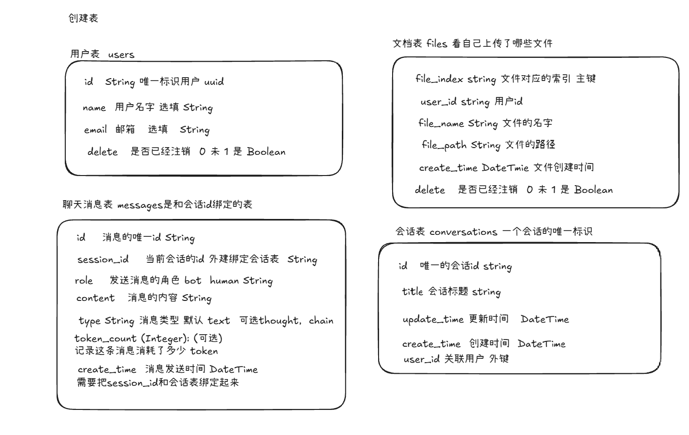
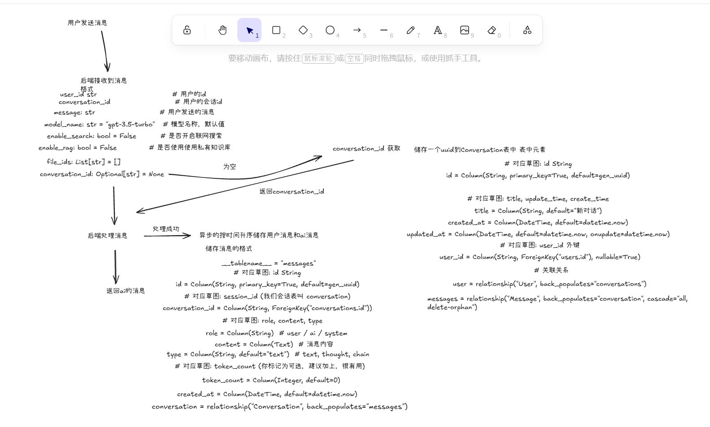

### 📅 知微项目开发冲刺表 (Dev Log)

| 日期         | 阶段 (Stage)   | 核心任务 (Task)                          | 进度   | 状态   | 遇到的坑/备注                  |
|------------|--------------|--------------------------------------|------|------|--------------------------|
| **Day 1**  | **基础骨架**     | 1. 搭建 FastAPI + Uvicorn 环境           | 100% | ✅ 完成 | 端口 8000 正常               |
| 2026-01-27 | (MVP 1.0)    | 2. 编写 `POST /api/chat` (Hello World) | 100% | ✅ 完成 | 记得加 CORS                 |
|            |              | 3. Vue 前端画出简单聊天框并调通接口                | 0%   | ⬜ 待办 | 解决跨域问题                   |
| ---        | ---          | ---                                  | ---  | ---  | ---                      |
| **Day 2**  | **接入大脑**     | 1. 安装 LangChain & 配置 `.env`          | 0%   | ⬜ 待办 | Key 要保密                  |
|            | (Model)      | 2. 实现 Service 层 (OpenAI/Ollama切换)    | 0%   | ⬜ 待办 | 封装 `ChatService`         |
|            |              | 3. 前端增加“模型选择”下拉框                     | 0%   | ⬜ 待办 |                          |
| ---        | ---          | ---                                  | ---  | ---  | ---                      |
| **Day 3**  | **RAG 核心**   | 1. 搭建向量库 (ChromaDB/FAISS)            | 0%   | ⬜ 待办 |                          |
|            | (Knowledge)  | 2. 写 `POST /api/upload` (解析PDF)      | 0%   | ⬜ 待办 | 用 PyPDFLoader            |
|            |              | 3. 修改 Chat 接口支持检索上下文                 | 0%   | ⬜ 待办 |                          |
| ---        | ---          | ---                                  | ---  | ---  | ---                      |
| **Day 4**  | **联网增强**     | 1. 调试 Tavily 搜索工具 (刚才的代码)            | 0%   | ⬜ 待办 | **重点：JSON 容错**           |
|            | (Tools)      | 2. 优化 Prompt (强制 JSON 输出)            | 0%   | ⬜ 待办 | 处理 OutputParserException |
| ---        | ---          | ---                                  | ---  | ---  | ---                      |
| **Day 5**  | **UI/UX 完善** | 1. 侧边栏历史记录 (`GET /history`)          | 0%   | ⬜ 待办 | 需要简单数据库                  |
|            | (Polish)     | 2. 消息流式输出 (Streaming)                | 0%   | ⬜ 待办 | 提升用户体验                   |

---

## 后端开发日志 

#### [2026-01-27] Day 1 开发记录

* **今日目标**：跑通前后端连接。
* **完成情况**：
* [x] 搭建了 FastAPI 骨架
* [x] 后端 `/api/chat` 接口写完了，Swagger 测试通过。
* [x] 还写了联网搜索的功能

* **遇到的问题**：
* *问题*：模块之间按返回的类型的不匹配，还有联网查询时的参数传递问题
* *解决*：修改了接收类型

#### [2026-01-28] Day 2 开发记录
* **今日目标**：加载文档知识库, 将向量储存到redis中
* **完成情况**：
* [x] rag
  - 实现文件切片接口
    - 文件加载流程 后端接收文件 -》将文件切片 并按照userid来储存到向量数据库中
  - 检索流程
* [x] mysql 储存数据
  - 设计表 [x] 
    - 用户表 会话表 聊天记录表 文件表
    - 
  
#### [2026-01-29] Day 3 开发记录
* **今日目标**：修改聊天逻辑 文档上传逻辑 需要储存在sqlite中
* **完成情况**：
* [x] 修改文件上传的逻辑
     - 前端传入文件和用户id,
     - 后端接收文件 
     - 将文件切片 
     - 储存到向量数据库中
     - 存入sqlite中，文件的id  用户id 文件原名
*  [x] 储存用户交流消息
      -  
*  [x] 添加查询删除接口
      - 根据会话id查消息
      - 根据userid查会话列表
      - 删除会话消息
      - 根据userid查看到上传的文件
      - 根据文件id删除文件
#### [2026-01-30] Day 4 开发记录
* **今日目标**：修改聊天逻辑 文档上传逻辑 需要储存在sqlite中
* **完成情况**：
* [x] 修改了项目名字从知微改为了循迹 XunJi 更加好打这个词了
* [x] 完成了文件的储存，开发和测试完了后端的接口
   - 测试接口
     - 文件删上传和删除
     - 根据用户id获取文件列表。
     - 获取会话列表，删除会话列表
     - 注册和登录用户
     - 用户聊天接口 使用联网搜索和使用rag检索增强搜索
* [x] 初步确定了前端页面的结构，开发出了样本

#### [2026-01-30] Day 5 开发记录
* **今日目标**：完成前端接口的开发 让前后端联系起来

### 📅 开发路线图 (Roadmap)

#### **第一阶段：基础设施搭建 (Infrastructure)**

*这是地基，做好了后面调接口会非常爽。*

1. **封装 Axios (`utils/request.js`)**：
* 设置基准地址 (Base URL)。
* **请求拦截**：自动在 Header 里塞入 `Authorization: Bearer Token`。
* **响应拦截**：统一处理错误，特别是 `401 Token过期` 自动跳转登录页。

2. **搭建 Pinia 仓库 (`stores/userStore.js`)**：
* 管理 `token` 和 `userInfo`。
* 实现 `login()`、`logout()`、`register()` 动作。
* 数据持久化（刷新页面不掉登录状态）。

#### **第二阶段：身份验证模块 (Authentication)**

*先把门禁系统做好，才能测试后面的功能。*

1. **新建登录页 (`views/Login.vue`)**：
* 简单的表单：用户名、密码。
* 调用 `userStore.login`。

2. **新建注册页 (`views/Register.vue`)**：
* 表单：用户名、邮箱、密码。
* 调用注册接口。

3. **配置路由守卫 (`router/index.js`)**：
* 没登录不让进 Chat 页面，强制踢回 Login。

#### **第三阶段：核心业务对接 (Core Business)**

*也就是把 `GeminiLayout.vue` 里的假数据换成真数据。*

1. **文件知识库对接**：
* **查**：组件加载时调用 `GET /api/files`，填充那个 Popover 里的文件列表。
* **传**：点击回形针图标 -> 触发文件选择 -> 调用 `POST /api/upload` -> 刷新列表。

2. **聊天对话对接**：
* **发**：点击发送 -> 调用 `POST /api/chat`。
* 参数组装：`message`, `enable_search` (你的开关状态), `file_ids` (选中的文件), `enable_rag` (是否有选中文件)。

* **收**：接收后端返回的 Markdown 文本。
* **展示**：引入 `markdown-it` 把后端返回的文本渲染成漂亮的 HTML（带代码高亮）。

#### [2026-02*01] Day 6 开发记录
* **今日目标** 完成了聊天树的开发 
* **完成情况**：
  - [x] 完成了聊天树的开发 可以展示用户和AI的对话历史
  - [x] 对前端页面进行了修改，让他更加好看了，功能也多了
    - [x] 再设置中可以增加模型
    - [x] 可以实时切换模型
    - [x] 可以同步聊天

* 明日计划 注销用户登录