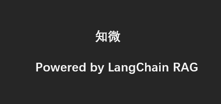
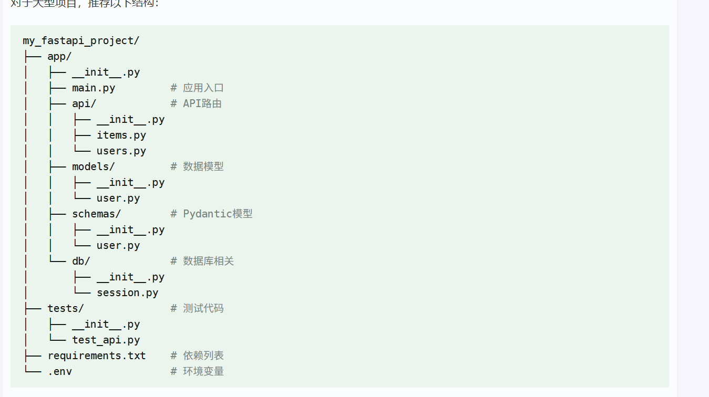

# 基于rag的模型交流平台

## logo

## 作用：
 - 能够读取本地文档，并且基于文档信息放回消息
 - 能够优雅的切换，支持ollama模型
 - 支持上下文记忆

## 使用方法：
1. 前后端分离
2. 前端仿照openwebui实现，不过精简 
   - 有交流模块
   - 切换模型
   - 本地知识库模块
3. 通过api接口来创建模型，支持自定义模型
4. 支持给模型设置指令
5. 并且支持联网搜索功能

## 技术栈
1. 后端
   1. 基于langchain框架。
   2. langchian 
       - 工具  @tool tavily 网页搜索工具
       - 模型结构返回数据  BaseModel
       - 模型封装  ChatGoogleGenerativeAI OpenAi DashScopeEmbeddings
       - redis向量数据库 RedisVectorStore
       - 上下文记忆 InMemoryChatMessageHistory
       - 模型流式输出 StrOutputParser
       - 模块链的思想 model | tool
       - 消息的预处理 ChatPromptTemplate FewShotChatMessagePromptTemplate
   3. 使用fastapi框架进行网络编程。
   4. 前端
      1. 使用vue框架，网页开发
      2. gemini pro, cursor 
# 项目结构

