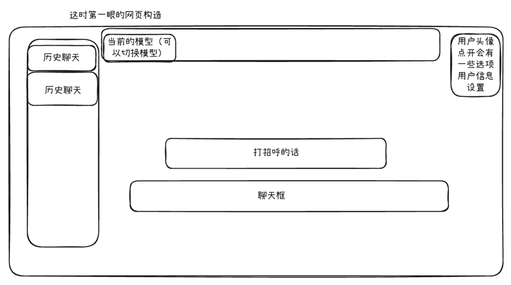
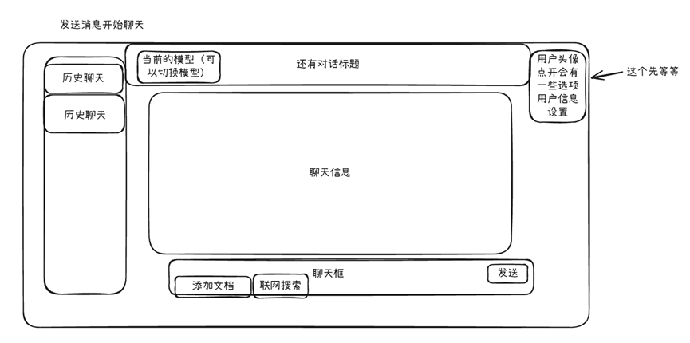

# 循迹

## 网页结构

### 第一步：界面拆解 vs API 映射

我们需要把草图里的每一个“可交互区域”都翻译成后端的接口。

#### 1. 左侧栏：历史聊天列表

* **需求**：一打开页面，左边要显示以前聊过啥。
* **API 1**：`GET /api/conversations`
* **作用**：获取会话列表（只要标题和 ID，不需要具体内容）。
* **返回**：`[{ "id": "1", "title": "关于 Java 的讨论" }, ...`

#### 2. 顶部栏：模型切换

* **需求**：点下拉框，显示支持的模型（如 GPT-4, Ollama-Llama3 等）。
* **API 2**：`GET /api/models`
* **作用**：告诉前端现在有哪些模型可用。
* **返回**：`[{ "id": "gpt-4", "name": "GPT-4 Turbo" }, { "id": "llama3", "name": "Llama 3 Local" }]`

#### 3. 核心区域：对话框 (最关键！)

这里包含两个动作：**加载历史记录** 和 **发送新消息**。

* **需求 A**：点击左侧某个历史记录，中间显示具体的对话气泡。
* **API 3**：`GET /api/conversations/{conversation_id}/messages`
* **作用**：获取某次聊天的所有往来记录。

* **需求 B**：在底部输入框输入文字，勾选“联网搜索”或“上传文档”，点击发送。
* **API 4**：`POST /api/chat`
* **作用**：发送用户消息，获取 AI 回复（支持流式输出）。
* **参数**：这是最复杂的接口，下面我会专门写代码。

#### 4. 底部功能区：添加文档

* **需求**：点击“添加文档”，上传 PDF/TXT，后端解析并存入向量库。
* **API 5**：`POST /api/upload`
* **作用**：接收文件 -> 解析文字 -> 存向量库 (RAG 预处理)。
* **返回**：`{ "file_id": "xyz", "status": "indexed" }`

